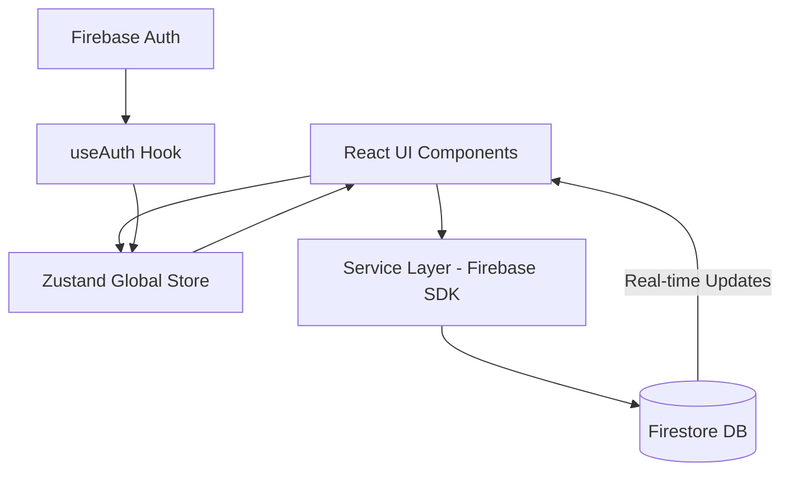

# Auditoria e Compreensão Total do Projeto: Hube CRM

Este documento serve como a **Fonte de Verdade Operacional (SoT)** para o projeto Hube CRM. Ele fornece uma visão sistêmica e detalhada da arquitetura, tecnologia e processos do sistema.

---

## 1️⃣ Visão Geral do Sistema

*   **Problema que resolve:** Gestão centralizada de relacionamento com o cliente (CRM) e suporte (Tickets) para empresas do setor de energia solar/gestão de energia.
*   **Usuários:** Equipes de Customer Success (CS) e Operações.
*   **Principais Casos de Uso:**
    *   Cadastro e gestão de clientes com múltiplas Unidades Consumidoras (UC).
    *   Acompanhamento de tickets de suporte com controle de SLA por prioridade.
    *   Visualização de métricas de desempenho e receita via Dashboard.
    *   Emissão e consulta de faturas de energia.
*   **Estágio Atual:** Produto funcional em fase de refinamento de segurança e performance (Beta Avançado/Produção Incipiente).

---

## 2️⃣ Arquitetura de Alto Nível

O sistema segue uma arquitetura **Modular Reativa** focada no ecossistema React.

### Fluxo de Dados


### Camadas do Sistema
1.  **UI Layer:** Componentes React 19 estilizados com Tailwind CSS 4.
2.  **State Layer:** Gerenciamento de estado global e persistência local via Zustand.
3.  **Service Layer:** Abstração da lógica de persistência e comunicação com Firebase.
4.  **Security Layer:** Regras de segurança do Firestore (Security Rules) protegendo o acesso direto aos dados.

### Integrações Externas
*   **Firebase:** Autenticação, Banco de Dados NoSQL e Hosting.

---

## 3️⃣ Stack Tecnológica

| Categoria | Tecnologia |
| :--- | :--- |
| **Linguagem** | JavaScript (ESNext) |
| **Framework Web** | React 19 |
| **Ferramenta de Build** | Vite |
| **Estilização** | Tailwind CSS 4 |
| **Estado Global** | Zustand |
| **Backend / DB** | Firebase (Firestore + Auth) |
| **Ícones** | Lucide React |
| **Gráficos** | Recharts |
| **Formulários** | React Hook Form |
| **Notificações** | React Hot Toast |
| **Processamento de Dados** | PapaParse (CSV), XLSX |

---

## 4️⃣ Estrutura de Diretórios Explicada

```text
/src
  ├── components/    # UI atômica e componentes de domínio (tickets, clients, charts)
  ├── hooks/         # Lógica compartilhada (auth, dashboard metrics, etc)
  ├── layouts/       # Estruturas de página (MainLayout com Sidebar/Header)
  ├── pages/         # Páginas completas (Login, Dashboard, Clientes, Tickets, Relatórios)
  ├── services/      # Comunicação com Firebase (clientService, ticketService)
  ├── stores/        # Store global Zustand (useStore)
  └── utils/         # Helpers, formatadores e validadores
/docs                # Documentação técnica exaustiva e histórico de decisões
/public              # Assets estáticos
/.agent             # Inteligência e contexto para agentes de IA
```

---

## 5️⃣ Fluxos Críticos do Sistema

### Autenticação e Perfil
1.  Usuário faz login via `LoginPage`.
2.  `useAuth` escuta a mudança de estado do Firebase Auth.
3.  Se autenticado, busca o documento do usuário em `/users/{uid}`.
4.  Armazena dados de perfil e permissões (roles, bases permitidas) no Zustand.

### Gestão de Tickets (SLA Flow)
1.  Ticket criado como sub-coleção: `/clients/{clientId}/tickets/{ticketId}`.
2.  Data de vencimento (`dueDate`) calculada automaticamente com base na prioridade:
    *   **Alta:** 4 horas
    *   **Média:** 24 horas
    *   **Baixa:** 48 horas
3.  O sistema possui lógica de `checkSLAEnforcement` para marcar tickets como `overdue`.

---

## 6️⃣ Modelos de Dados

### Entidades Principais
*   **Clients:** `database`, `name`, `email`, `phone`, `status`, `database` (projeto), `createdAt`.
*   **Tickets:** `protocol`, `subject`, `status` (open, in_progress, resolved, closed), `priority`, `dueDate`, `overdue`.
*   **Users:** `name`, `role` (admin, editor, user), `allowedBases`, `photoURL`.
*   **Audit Logs:** `userId`, `action`, `timestamp`, `details`.

---

## 7️⃣ Padrões e Convenções

*   **Padrão de UI:** Premium & Desktop-focused. Uso de Glassmorphism e sombras suaves.
*   **Lazy Loading:** Páginas carregadas dinamicamente para reduzir o bundle inicial.
*   **Security First:** Regras de Firestore validam schema e roles antes de qualquer escrita.
*   **Clean Code:** Separação clara entre componentes visuais, hooks de lógica e serviços de dados.

---

## 8️⃣ Pipeline e DevOps

*   **Ambiente Local:** `npm run dev` (Vite).
*   **Build:** `npm run build` gera o diretório `/dist`.
*   **Deploy:** Automatizado via GitHub Actions (`deploy.yml`) para Firebase Hosting.
*   **Secrets:** Configurados no GitHub Actions para injetar variáveis de ambiente do Firebase durante o build.

---

## 9️⃣ Cobertura de Testes e Qualidade

*   **Estado Atual:** Foco em testes funcionais manuais e validação de schema via Firestore Rules.
*   **Lacunas:** Ausência de testes unitários automatizados (Jest/Vitest) e testes de integração E2E (Playwright/Cypress).

---

## 🔟 Débito Técnico e Riscos

1.  **Dependência de Client-Side Search (Severidade Média):** Atualmente, a busca de clientes carrega todos os dados para filtrar no front. Com o crescimento da base, isso causará lentidão.
2.  **Acoplamento Firebase (Severidade Baixa):** O sistema é altamente dependente do Firebase. Uma migração exigiria reescrever toda a camada de `services`.
3.  **Complexidade de Sub-coleções (Severidade Baixa):** A estrutura de tickets em sub-coleções de clientes exige queries de `collectionGroup`, que podem ter custos superiores em larga escala.

---

## 11️⃣ Glossário de Domínio

*   **UC (Unidade Consumidora):** Identificador técnico do ponto de consumo de energia do cliente.
*   **Base/Database:** Identificador de projeto ou inquilino (Tenancy) dentro do CRM (ex: EGS, Girassol).
*   **SLA (Service Level Agreement):** Prazo acordado para resolução de um ticket.
*   **Overdue:** Status dado a um ticket que ultrapassou seu prazo de vencimento original.

---

## 12️⃣ Como Contribuir com Segurança

1.  **Não altere a estrutura de serviços** sem verificar as `firestore.rules`.
2.  **Sempre use o hook `useStore`** para acessar o estado global, evite passar props em excesso (prop drilling).
3.  **Adicione novos temas estilizados** no `@theme` dentro de `index.css` (Tailwind 4).
4.  **Mantenha as páginas Desktop-friendly**, priorizando visualização de dados densos.

---

## Próximos Passos Sugeridos

1.  **Implementação de Busca Server-Side:** Integrar Algolia ou usar Firestore Full-Text Search para escalar a pesquisa de clientes.
2.  **Suíte de Testes Automatizados:** Iniciar com testes unitários para a camada de `utils` e `services`.
3.  **Sistema de Notificações em Tempo Real:** Implementar alertas push para tickets que entram em regime de atraso (Overdue).
4.  **Módulo Financeiro:** Consolidar a visualização de faturas e pagamentos pendentes mencionada nos documentos de arquitetura.
