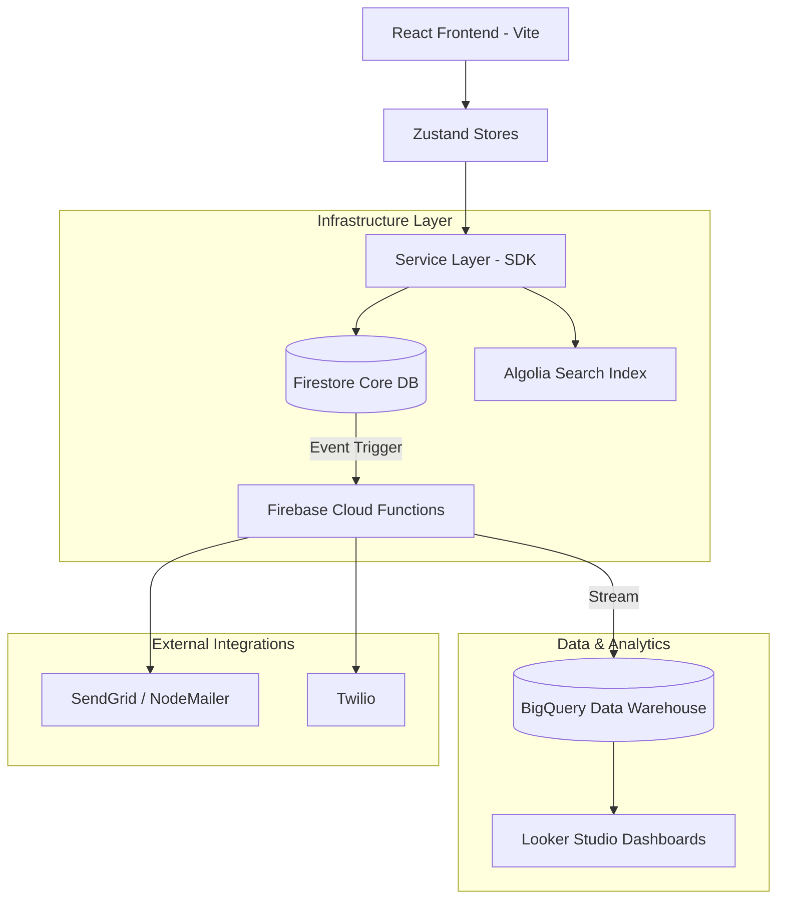

# Arquitetura Alvo e Blueprint Evolutivo: Hube CRM

Este documento define a arquitetura de estado final (Target Architecture) do Hube CRM, projetada para suportar escala SaaS massiva, isolamento multi-tenant rigoroso e eficiência de custos.

---

## 1️⃣ Visão Geral da Evolução

O objetivo é transitar de um monólito frontend acoplado ao Firebase para uma arquitetura distribuída resiliente e orientada a inquilinos (tenants).

### Diagrama: Arquitetura Alvo

---

## 2️⃣ Modelo de Tenancy Definitivo

Recomendamos o modelo de **Hybrid Tenancy (Isolamento Lógico com Vinculação Estrita)**.

| Modelo | Escolha | Justificativa |
| :--- | :---: | :--- |
| **Logical Tenancy** | Sim | Custo-benefício no Firebase. Isolamento via campo `database` em todos os docs. |
| **Structural Tenancy** | Não | Múltiplas instâncias do Firestore aumentariam drasticamente o custo e complexidade de gestão. |
| **Reforço de Segurança** | Sim | Uso de Custom Claims no JWT para validar permissões sem consultas extras ao DB. |

---

## 3️⃣ Estrutura de Dados de Próxima Geração

### Coleção: `clients` (Root)
*   Inclui campos de busca normalizados (lowercase) para facilitar queries parciais nativas antes da migração para Algolia.
*   Campo `isDeleted` para Soft Delete.

### Coleção: `tickets` (Migração de Sub para Root)
*   **Decisão:** Mover tickets de `/clients/{id}/tickets` para uma root collection `/tickets`.
*   **Motivo:** Facilita queries cross-client por projeto e simplifica a lógica de `collectionGroup` que hoje é um gargalo de segurança.
*   **Schema:** `{ id, clientId, database, subject, status, ... }`

### Coleção: `aggregations` (Metadados de Performance)
*   Documentos que armazenam totais pré-calculados (ex: `stats_EGS`) atualizados via Cloud Functions.
*   Elimina a necessidade de ler documentos para calcular métricas no Dashboard.

---

## 4️⃣ Estratégia de Busca e Performance

| Escala | Estratégia | Ferramenta |
| :--- | :--- | :--- |
| **< 1k Clientes** | Firestore native indexing | Queries de prefixo (`>=` e `<=`). |
| **1k - 50k Clientes** | Server-side Third-party | **Algolia** (Sincronização via Cloud Functions). |
| **> 50k Clientes** | Hybrid + Elastic | BigQuery para buscas analíticas e Algolia para busca operacional. |

---

## 5️⃣ Camada de Negócio e Automações (Cloud Functions)

As Cloud Functions assumirão o papel de "Backend" para tarefas pesadas ou sensíveis:
1.  **SLA Enforcer:** Cron job que roda a cada 15 min para marcar tickets como `overdue`.
2.  **Integridade de Dados:** Função `onWrite` que garante que o campo `database` nunca mude após a criação.
3.  **Audit Trigger:** Gravação automática de logs de segurança em coleções protegidas.

---

## 6️⃣ Projeção de Performance e Custo

| Cenário | Latência UI | Custo Firestore (Mensal est.) | Foco Principal |
| :--- | :--- | :--- | :--- |
| **1k Clientes** | ~200ms | Tier Gratuito | Estabilidade |
| **10k Clientes** | ~400ms | $25 - $50 | Otimização de busca |
| **100k Clientes** | ~800ms | $150 - $300 | Agregações e BigQuery |

---

## 🛠️ Roadmap Evolutivo

### Fase 1: Hardening de Segurança (P0)
*   [ ] Implementar Custom Claims para `role` e `allowedBases`.
*   [ ] Refatorar Firestore Rules para isolamento total (Hybrid Tenancy).
*   [ ] Adicionar campo `database` em todos os documentos existentes.

### Fase 2: Escala e Performance (P1)
*   [ ] Migrar tickets de sub-coleção para Root Collection.
*   [ ] Integrar Algolia para busca de clientes e tickets.
*   [ ] Implementar Soft Delete e filtros globais de "esconder deletados".

### Fase 3: Maturidade SaaS (P2)
*   [ ] Deploy de Cloud Functions para automação de SLA e métricas.
*   [ ] Configurar exportação contínua para BigQuery.
*   [ ] Implementar sistema de faturamento automático baseado no consumo de energia.

---

## ⚠️ Riscos de Migração e Mitigação

1.  **Backfill de Tenancy:** Milhares de documentos podem não ter o campo `database`.
    *   *Solução:* Script de migração atômica via Firebase Admin SDK.
2.  **Downtime de Busca:** A troca do client-side para Algolia pode causar "fios soltos".
    *   *Solução:* Lógica de fallback no frontend que usa busca nativa se a API do Algolia falhar.
3.  **Custos de Reindexação:** Adicionar muitos índices compostos simultaneamente gera picos de faturamento.
    *   *Solução:* Criar índices de forma faseada conforme o volume de dados aumenta.
4.  **Inconsistência de Cache:** A persistência offline do Firestore pode mostrar dados antigos durante a migração.
    *   *Solução:* Limpar cache do browser forçadamente via Service Worker após deploy de versões estruturais.
